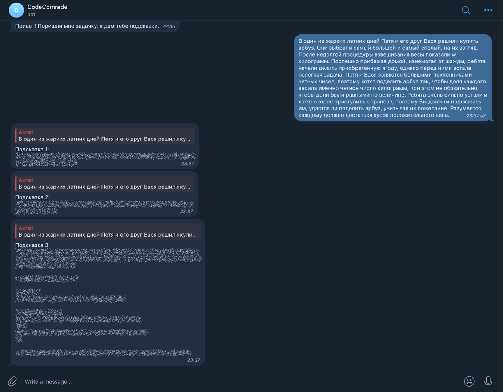
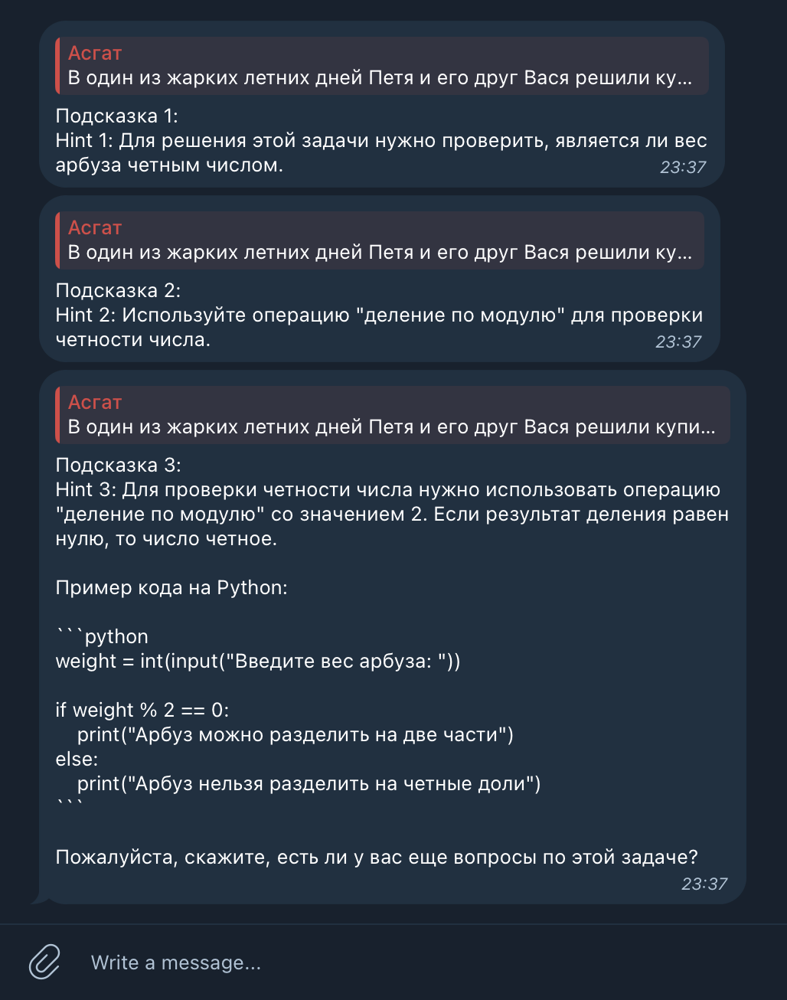

  

<h3 align="center">CodeComrade</h3>

---

A real friend won't let you cheat! 🤖 
CodeComrade - a TG bot that helps students by providing helpful hints for different problems, but not giving out the whole solution to copy.
      

## 📝 Table of Contents

- [About](#about)
- [Demo / Working](#demo)
- [How it works](#working)
- [Usage](#usage)
- [Deploying your own bot](#deployment)
- [TODO](../TODO.md)
- [Acknowledgements](#acknowledgement)

## 🧐 About 
<b>Problem:</b> 
<pre>
  When solving problems, many people have problems, sometimes a person does not understand where to start a solution. In such circumstances, cheating or mindless copying of the solution often occurs. Thus, a person does not learn and forgets the solution over time, instead of learning how to solve this problem.
</pre>
   
<b>Solution:</b> 
<pre>
  A telegram bot that gives hints and leads to a solution without giving a complete solution.
</pre>

## 🎥 Demo / Working 

## 💭 How it works 
<b>1. Getting responce from OpenAI:</b>
<pre>
response = client.chat.completions.create(
                model="gpt-3.5-turbo",
                messages=[
                    {"role": "system", "content": "You are an assistant skilled in explaining olympiad programming tasks who speaks russian language and provides useful links for resources when its is needed. You should give 3 levels of hints: Hint 1: (easy hint), Hint2: (medium hint), Hint 3: (full hint). If a certain algorithm is needed, state the name of it in the Hint 2. Also provide code in Hint 3. Format the output like this: Hint 1: ... Hint 2: ... Hint 3: ... ."},
                    {"role": "user", "content": f"Помоги с решением этой задачи:\n\n{text}"}
                ]
      )
</pre>
<b>2. Formatting telegram output:</b>
<pre>
def secretize_hint(hint, n):
    hint = hint.split('\n')
    for i in range(len(hint)):
        hint[i] = f'||{hint[i]}||'
    hint = f"Подсказка {n}:\n" + '\n'.join(hint)
    
    return hint
  
for c in ['_', '`', '*', '[', ']', '(', ')', '~', '>', '#', '+', '-', '=', '|', '{', '}', '.', '!' ]:
                explanation = explanation.replace(c, f'\\{c}')

hint1 = explanation[explanation.find("Hint 1:"):explanation.find("Hint 2:")]
            hint1 = secretize_hint(hint1, 1)
</pre>

## 🎈 Usage 

@code_comrade_bot

Just send it a problem.

The bot will then give you 3 hints in secrets.

## 🚀 Deploying your own bot 

<pre>
1. Install all packages used in the project.
2. Pass your API keys to mysecrets.py
3. RUN bot.py
</pre>

## ⛏️ Built Using 

- OpenAI API
- BotFather
- Telebot
- Python

## 🎉 Acknowledgements 

Project paper and presentaion in russian: [link](./АкмаевА_11А%202.zip)